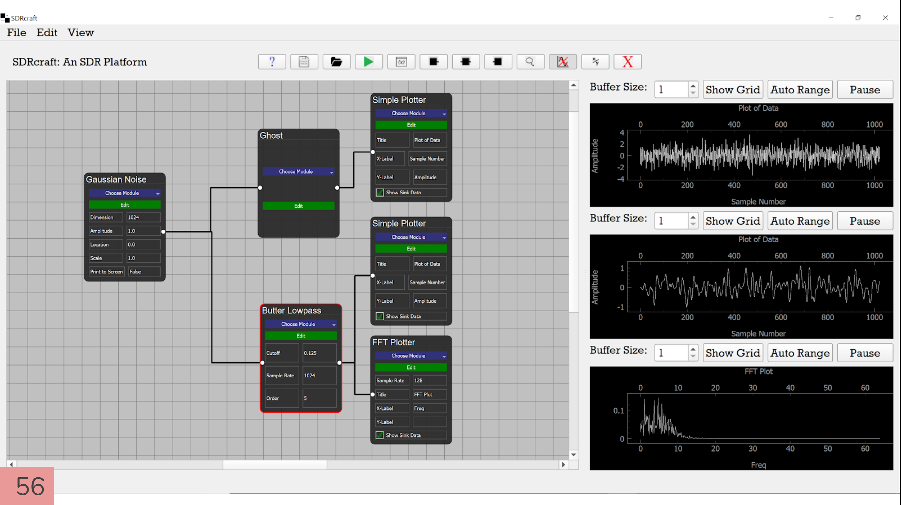

## Simulation Platform for Software Defined Radio
The project goal was given pretty loosely. We were given the task of creating a platform, similar in style and functionality to GNU Radio, providing functionality in the software defined radio genre. We took that goal, and modified it with the ambition of designing a signal processing tool that replicates the intention of GNUradio, while improving its look and trying a new method for ease of use. 

The result was a sleek, modern, block diagram based design that allows for many complex interactions to be modeled. It has an extensible architecture to allow for the easy addition of processing blocks. It also provides multiple analysis tools for examining and transforming data. The flow chart style signal processing tool was developed primarily with PyQt5 and PyQtGraphing on the front end, with ZeroMQ networking controlling the backend performance, and the python based program took advantage of NumPy and SciPy for the signal evaluations.

## The Application

## The Architecture

